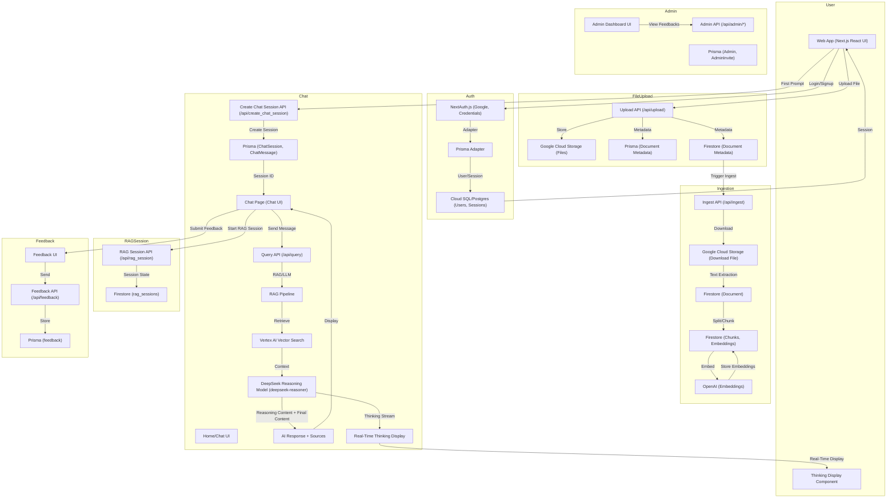

# System Architecture & Workflow



## 🧠 **DeepSeek Reasoning Model Integration**

### **Native Reasoning Model**
- **Model**: `deepseek-reasoner` with native `reasoning_content` and `content` fields
- **Streaming**: Real-time streaming of thinking process and final response
- **Separation**: Automatic separation of internal analysis from user-facing content

### **Thinking Display Component**
- **File**: `app/components/ThinkingDisplay.tsx`
- **Features**: Collapsible interface, real-time streaming, professional styling
- **Integration**: Seamless integration with chat interface
- **Accessibility**: Screen reader friendly with ARIA attributes

### **Streaming Architecture**
```
DeepSeek Reasoning Model
├── reasoning_content (Internal Analysis)
│   ├── Task Classification
│   ├── Document Type Identification
│   ├── Objective Extraction
│   └── ... (12-step pipeline)
└── content (Final Response)
    ├── Professional Legal Analysis
    ├── Recommendations
    └── User-Facing Content
```

### **Frontend Integration**
- **State Management**: `isThinking` and `thinkingContent` states
- **Real-Time Updates**: Live streaming of thinking content
- **UI Components**: Professional thinking display with animations
- **Error Handling**: Robust fallback mechanisms

## Document Management UI

- The main page supports file upload with progress and error feedback.
- A document dashboard lists uploaded documents, allows download (via signed URL), and delete.
- All actions are per-user and require authentication.

## Admin Dashboard

- **Feedback Management**: View all user feedback with filtering and pagination
- **Admin Authentication**: Secure invitation-based admin system with audit trail
- **User Analytics**: Dashboard statistics and user activity monitoring
- **Admin Invitations**: Create and manage admin user invitations
- **Session Viewing**: View chat sessions to understand feedback context
- **Database Integration**: PostgreSQL-based storage with proper relations and constraints

## Test Scripts

- Test scripts are provided in the `scripts/` directory:
  ```bash
  # Firestore chat session fetch
  ts-node scripts/test-firestore-chat-sessions.ts
  # Firestore chat session creation
  ts-node scripts/test-firestore-chat-sessions.ts --create
  # Prisma user creation
  ts-node scripts/test-prisma.ts
  # File upload to GCS
  ts-node scripts/test-upload-gcs.ts
  # RAG query endpoint
  ts-node scripts/test-rag-query.ts
  # Feedback submission
  ts-node scripts/test-firestore-feedback.ts
  # Authentication (Google and credentials)
  ts-node scripts/test-auth-credentials.ts
  # OpenAI embedding
  ts-node scripts/test-openai-embedding.ts
  # DeepSeek API
  ts-node scripts/test-deepseek-api.ts
  # Supabase test (if used)
  ts-node scripts/test-supabase.ts
  ``` 