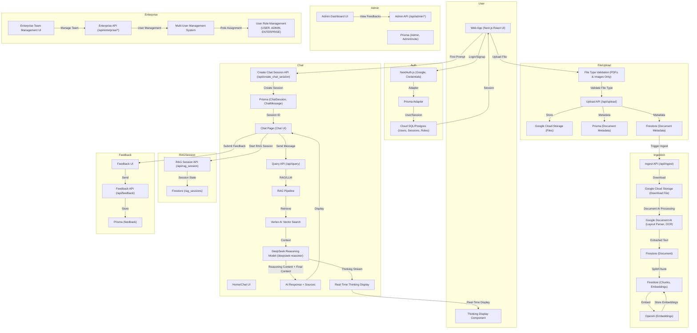

# System Architecture & Workflow



## 🧠 **DeepSeek Reasoning Model Integration**

### **Native Reasoning Model**
- **Model**: `deepseek-reasoner` with native `reasoning_content` and `content` fields
- **Streaming**: Real-time streaming of thinking process and final response
- **Separation**: Automatic separation of internal analysis from user-facing content

### **Thinking Display Component**
- **File**: `app/components/ThinkingDisplay.tsx`
- **Features**: Collapsible interface, real-time streaming, professional styling
- **Integration**: Seamless integration with chat interface
- **Accessibility**: Screen reader friendly with ARIA attributes

### **Streaming Architecture**
```
DeepSeek Reasoning Model
├── reasoning_content (Internal Analysis)
│   ├── Task Classification
│   ├── Document Type Identification
│   ├── Objective Extraction
│   └── ... (12-step pipeline)
└── content (Final Response)
    ├── Professional Legal Analysis
    ├── Recommendations
    └── User-Facing Content
```

### **Frontend Integration**
- **State Management**: `isThinking` and `thinkingContent` states
- **Real-Time Updates**: Live streaming of thinking content
- **UI Components**: Professional thinking display with animations
- **Error Handling**: Robust fallback mechanisms

## 📁 **File Upload & Document Processing**

### **Supported File Types**
- **PDFs**: `application/pdf` - Full Document AI Layout Parser support
- **Images**: `image/jpeg`, `image/jpg`, `image/png`, `image/gif`, `image/bmp`, `image/webp` - OCR processing
- **Restriction**: DOCX, DOC, TXT, and other formats are not supported for optimal processing quality

### **File Upload Flow**
1. **Client Validation**: File type checked before upload
2. **User Feedback**: Clear toast message for unsupported files
3. **Storage**: Files stored in Google Cloud Storage
4. **Processing**: Document AI Layout Parser for PDFs, OCR for images
5. **Ingestion**: Text extraction, chunking, and embedding generation

### **Document AI Integration**
- **Layout Parser**: Used for PDFs and structured documents
- **OCR**: Used for image files and scanned documents
- **Intelligent Selection**: Automatic processor selection based on file type
- **Confidence Scoring**: Quality assessment of extracted text

## 🏢 **Multi-User Enterprise System**

### **User Roles**
- **USER**: Standard individual users
- **ADMIN**: Asvara platform administrators
- **ENTERPRISE**: Enterprise customers with team management capabilities

### **Enterprise Features**
- **Team Management**: Enterprise users can create and manage team members
- **Multi-User Permissions**: Controlled by `multiUser` boolean flag
- **User Hierarchy**: Managed users linked to enterprise account via `managedById`
- **Role-Based Access**: Different permissions based on user role

### **API Endpoints**
- **Enterprise Users**: `/api/enterprise/users` - List and manage team members
- **Admin Multi-User**: `/api/admin/multi-user` - Grant/revoke multi-user permissions
- **User Management**: Full CRUD operations for team members

### **Database Schema**
```sql
User {
  role: USER | ADMIN | ENTERPRISE
  multiUser: Boolean (default: false)
  managedUsers: User[] (relation)
  managedBy: User? (relation)
  managedById: String?
}
```

## Document Management UI

- The main page supports file upload with progress and error feedback.
- A document dashboard lists uploaded documents, allows download (via signed URL), and delete.
- All actions are per-user and require authentication.

## Admin Dashboard

- **Feedback Management**: View all user feedback with filtering and pagination
- **Admin Authentication**: Secure invitation-based admin system with audit trail
- **User Analytics**: Dashboard statistics and user activity monitoring
- **Admin Invitations**: Create and manage admin user invitations
- **Session Viewing**: View chat sessions to understand feedback context
- **Database Integration**: PostgreSQL-based storage with proper relations and constraints

## 🔧 **Current System Status**

### **Production-Ready Features**
- ✅ **Authentication**: Google OAuth + Credentials with NextAuth.js
- ✅ **File Upload**: PDF and image support with Document AI processing
- ✅ **Chat System**: Real-time messaging with DeepSeek reasoning model
- ✅ **RAG Pipeline**: Document retrieval and AI-powered responses
- ✅ **Admin Dashboard**: Feedback management and user analytics
- ✅ **Enterprise System**: Multi-user team management (API ready)
- ✅ **Thinking Display**: Real-time AI reasoning visualization

### **File Processing Capabilities**
- ✅ **PDFs**: Full Document AI Layout Parser support
- ✅ **Images**: OCR processing for scanned documents
- ❌ **DOCX/DOC**: Not supported (shows user-friendly error message)
- ❌ **TXT/MD**: Not supported (shows user-friendly error message)

### **User Experience**
- ✅ **Clear Feedback**: Toast notifications for unsupported file types
- ✅ **File Validation**: Client-side validation before upload
- ✅ **Error Handling**: Graceful handling of processing failures
- ✅ **Real-time Updates**: Live progress indicators and status updates

### **Security & Performance**
- ✅ **Rate Limiting**: API endpoints protected against abuse
- ✅ **Input Validation**: Comprehensive request validation
- ✅ **Error Logging**: Structured logging with Pino
- ✅ **Database Optimization**: Efficient queries with Prisma 