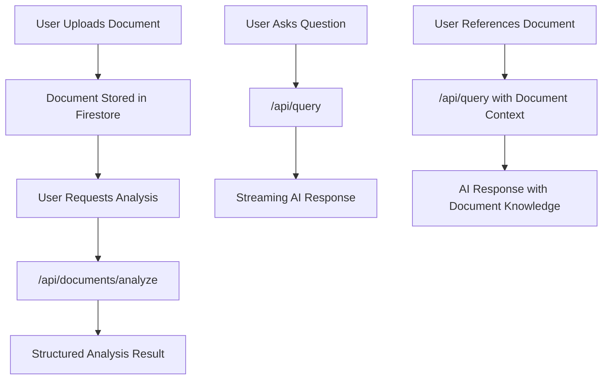

# DocBare

A modern legal AI platform for agentic RAG (Retrieval-Augmented Generation), chat, and document analysis. Built with Next.js, Prisma, Firestore (GCP), and OpenAI.

## 📚 Documentation

Comprehensive documentation is available in the **[Docs](Docs/)** directory:

- **[📖 Documentation Index](Docs/README.md)** - Complete documentation overview
- **[🚀 Setup Guide](Docs/SETUP_GUIDE.md)** - Getting started and installation
- **[🏗️ System Architecture](Docs/SYSTEM_ARCHITECTURE.md)** - Technical architecture and workflows
- **[📋 Progress Status](Docs/PROGRESS_STATUS.md)** - Current project status and TODO items
- **[🔧 API Endpoints](Docs/API_ENDPOINTS.md)** - Complete API reference
- **[🔥 Firestore Guide](Docs/FIRESTORE_GUIDE.md)** - Database setup and management
- **[📊 Codebase Analysis](Docs/CODEBASE_ANALYSIS.md)** - Detailed codebase assessment
- **[📈 Implementation Plan](Docs/IMPLEMENTATION_PLAN.md)** - Feature roadmap and planning

## 🚀 Quick Start

1. **Clone and install:**
   ```bash
   git clone <your-repo-url>
   cd docbare
   npm install
   ```

2. **Set up environment variables** (see [Setup Guide](Docs/SETUP_GUIDE.md) for details)

3. **Run migrations and start:**
   ```bash
   npx prisma migrate dev
   npm run dev
   ```

4. **Open [http://localhost:3000](http://localhost:3000)**

## 🏗️ Architecture Overview

- **Frontend:** Next.js 14 (App Router, React)
- **Backend:** Next.js API Routes, Prisma ORM, Firestore
- **AI:** DeepSeek LLM, OpenAI Embeddings, Vertex AI Vector Search
- **Storage:** Google Cloud Storage, PostgreSQL, Firestore
- **Auth:** NextAuth.js (Google OAuth, Credentials)

For detailed architecture information, see **[System Architecture](Docs/SYSTEM_ARCHITECTURE.md)**.

## 🔮 Future Scope: Multi-Agent AI Architecture

### **Proposed Three-Agent System**

The platform is designed to evolve into a sophisticated multi-agent AI system with the following architecture:

#### **1. Manager/Orchestrator Agent**
- **Role:** Central coordinator and workflow manager
- **Responsibilities:**
  - Route user queries to appropriate agents
  - Manage conversation flow and context
  - Coordinate between analysis and writing agents
  - Handle iterative improvement cycles
  - Maintain session state and user intent

#### **2. Document Analysis Agent**
- **Role:** Specialized in legal document understanding and critique
- **Responsibilities:**
  - Analyze uploaded legal documents
  - Extract key legal concepts, clauses, and implications
  - Generate detailed analysis reports
  - Identify potential issues or improvements
  - Provide structured feedback for document enhancement

#### **3. Document Writing Agent**
- **Role:** Specialized in legal document drafting and generation
- **Responsibilities:**
  - Draft new legal documents from scratch
  - Enhance existing documents based on analysis feedback
  - Generate legal correspondence, contracts, and agreements
  - Ensure legal compliance and best practices
  - Iterate on documents based on analysis agent feedback

### **Workflow Patterns**

#### **Scenario 1: Direct Document Drafting**
```
User Query → Manager Agent → Writing Agent → Final Document
```

#### **Scenario 2: Document Analysis + Enhancement**
```
User Upload + Query → Manager Agent → Analysis Agent → 
Analysis Report → Writing Agent → Enhanced Document
```

#### **Scenario 3: Iterative Improvement**
```
Draft Document → Analysis Agent → Feedback → 
Writing Agent → Improved Document → (Repeat if needed)
```

### **Technical Implementation Considerations**
- **Agent Communication:** Structured message passing with context preservation
- **State Management:** Centralized session state for multi-turn conversations
- **Error Handling:** Graceful degradation when agents are unavailable
- **Performance:** Parallel processing where possible, sequential where required
- **Scalability:** Agent instances can be scaled independently based on load

### **Benefits of Multi-Agent Approach**
- **Specialization:** Each agent optimized for specific tasks
- **Modularity:** Easy to update or replace individual agents
- **Flexibility:** Support for complex, multi-step legal workflows
- **Quality:** Iterative improvement through agent collaboration
- **Extensibility:** Easy to add new specialized agents in the future

*This architecture represents the next evolution of DocBare, building upon the current RAG and chat capabilities to provide comprehensive legal document services.*

## 📊 Project Status

For detailed project status, completed features, and TODO items, see **[Progress Status](Docs/PROGRESS_STATUS.md)**.

## 🔧 API Reference

For complete API documentation with request/response formats, see **[API Endpoints](Docs/API_ENDPOINTS.md)**.

## 🔥 Firestore & Database

For Firestore setup, security rules, and database management, see **[Firestore Guide](Docs/FIRESTORE_GUIDE.md)**.

## 📈 Development & Planning

- **[Codebase Analysis](Docs/CODEBASE_ANALYSIS.md)** - Detailed assessment of current codebase
- **[Implementation Plan](Docs/IMPLEMENTATION_PLAN.md)** - Comprehensive roadmap and feature planning

## 🧪 Testing

- **E2E Tests:** Playwright tests in the `e2e/` directory
- **Test Scripts:** Various test scripts in the `scripts/` directory for API testing

## 📖 Learn More

- [Next.js Documentation](https://nextjs.org/docs)
- [Prisma Documentation](https://www.prisma.io/docs)
- [Google Firestore Documentation](https://cloud.google.com/firestore/docs)
- [Google Cloud Storage Documentation](https://cloud.google.com/storage/docs)
- [OpenAI API](https://platform.openai.com/docs)
- [DeepSeek API](https://api-docs.deepseek.com)
- [LangChain JS](https://js.langchain.com/docs/)
- [NextAuth.js](https://next-auth.js.org/)

## 🚀 Deploy on Vercel

The easiest way to deploy your Next.js app is to use the [Vercel Platform](https://vercel.com/new?utm_medium=default-template&filter=next.js&utm_source=create-next-app&utm_campaign=create-next-app-readme).


