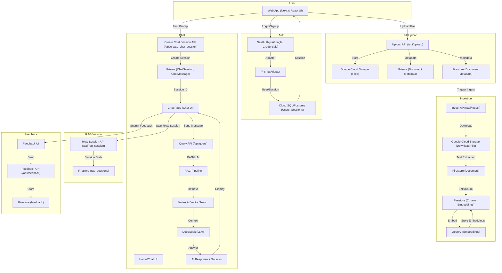

# DocBare

A modern legal AI platform for agentic RAG (Retrieval-Augmented Generation), chat, and document analysis. Built with Next.js, Prisma, Firestore (GCP), and OpenAI.

---

## Getting Started

1. **Clone the repo:**
   ```bash
   git clone <your-repo-url>
   cd docbare
   ```
2. **Install dependencies:**
   ```bash
   npm install
   # or
   yarn install
   ```
3. **Set up your environment variables:**
   - Copy `.env.example` to `.env` and fill in all required values:
     - `DATABASE_URL`, `DIRECT_URL` (PostgreSQL/Cloud SQL)
     - `OPENAI_API_KEY` (for embeddings)
     - `GOOGLE_CLIENT_ID`, `GOOGLE_CLIENT_SECRET`, `NEXTAUTH_URL`, `NEXTAUTH_SECRET`
     - `FIRESTORE_PROJECT_ID` (Firestore/NoSQL backend)
4. **Run database migrations:**
   ```bash
   npx prisma migrate dev
   ```
5. **Start the development server:**
   ```bash
   npm run dev
   # or
   yarn dev
   ```
6. **Open [http://localhost:3000](http://localhost:3000) in your browser.**

---

## Backend Architecture

- **Next.js** (App Router, API routes)
- **Prisma ORM** (Cloud SQL/PostgreSQL for users, auth, subscriptions, chat session metadata)
- **Firestore** (GCP, for unstructured data: documents, chunks, embeddings, RAG sessions, agent state, feedback, chat)
- **Google Cloud Storage** (for file uploads, if needed)
- **OpenAI** (for embeddings)
- **DeepSeek** (for LLM/chat/completions)
- **NextAuth.js** (Google OAuth and credentials-based authentication)

---

## API Endpoints

- `POST /api/upload` — Upload a file (Google Cloud Storage + metadata in Postgres + Firestore)
- `POST /api/ingest` — Ingest and embed a document (chunks/embeddings in Firestore)
- `POST /api/query` — RAG: retrieve relevant chunks and synthesize answer
- `POST|GET /api/chat` — Store/retrieve chat messages (Firestore)
- `POST|PATCH /api/rag_session` — Create/update a RAG session (Firestore)
- `GET /api/rag_session/[sessionId]` — Fetch a RAG session by ID (Firestore)
- `POST /api/feedback` — Submit user feedback for a session (Firestore)
- `GET /api/feedback/[sessionId]` — Fetch all feedback for a session (Firestore)
- `GET /api/sessions/[sessionId]` — Fetch all chat messages for a session (Firestore)

---

## Progress

### ✅ Completed

- **Authentication:** Google OAuth and credentials (NextAuth.js, shared with Asvara site)
- **User Management:** Profile, API keys, subscriptions (Cloud SQL/Postgres)
- **File Upload:** Google Cloud Storage integration, metadata in Postgres and Firestore
- **Document Ingestion:** Chunking, embedding, and storage in Firestore
- **RAG Pipeline (Production):**
  - Query embedding via DeepSeek API (or OpenAI/Gemini, configurable)
  - Semantic retrieval using Vertex AI Vector Search (GCP)
  - RAG prompt construction and answer synthesis using DeepSeek LLM
  - Logging of queries, answers, and sources to Cloud SQL (Prisma) and Firestore
  - All API endpoints implemented as Next.js API routes, ready for Cloud Run
- **Chat System:**
  - Chat session/message models in Prisma/Postgres
  - Chat message storage/retrieval in Firestore
- **RAG Sessions:**
  - Session state, memory, agent state, and results in Firestore
- **Feedback:** User feedback collection and retrieval (Firestore)
- **API Endpoints:** All major endpoints for upload, ingest, query, chat, session, and feedback
- **Ingestion Script:** CLI for bulk document ingestion and embedding (Firestore)
- **Frontend Integration:**
  - Authentication integrated into UI (login, session management)
  - Home page creates new chat session and redirects to chat on first prompt
  - Chat page fetches messages/session metadata, sends messages, displays chat history
  - Axios for backend HTTP requests
  - RAG/AI response displayed after user message
  - Feedback UI for session rating/comments
  - Loading and error states for all major UI actions
  - Responsive, mobile-friendly chat UI with subtle animations
  - TypeScript and NextAuth type safety (session.user.id, type extensions, etc.)

### 🚧 TODO / In Progress

- **Prisma Document Model:** (issue in /api/upload.ts)
  - `prisma.document` is not yet available; add Document model to Prisma schema and migrate
- **Frontend:**
  - Further polish for chat/session/feedback UI
  - Display RAG session state and results
  - User dashboard for document and session management
- **Admin Tools:**
  - Admin dashboard for monitoring, analytics, and moderation
- **Security:**
  - Add rate limiting, improved error handling, and input validation
  - Add logging and monitoring for production
- **Testing:**
  - Add unit/integration tests for all APIs
- **Docs:**
  - Document all API endpoints and request/response formats
  - Add setup and deployment instructions for contributors
- **Advanced RAG:**
  - Multi-modal support (images, audio)
  - More advanced agent orchestration and tool use
  - Multi-step agentic reasoning and reranking (planned enhancement)
- **SSO / Cross-site Login:**
  - Planned: If a user is logged in at the Asvara site, they should not have to log in again at DocBare (Single Sign-On / shared session).

---

## Learn More

- [Next.js Documentation](https://nextjs.org/docs)
- [Prisma Documentation](https://www.prisma.io/docs)
- [Google Firestore Documentation](https://cloud.google.com/firestore/docs)
- [Google Cloud Storage Documentation](https://cloud.google.com/storage/docs)
- [OpenAI API](https://platform.openai.com/docs)
- [LangChain JS](https://js.langchain.com/docs/)
- [NextAuth.js](https://next-auth.js.org/)

---

## Deploy on Vercel

The easiest way to deploy your Next.js app is to use the [Vercel Platform](https://vercel.com/new?utm_medium=default-template&filter=next.js&utm_source=create-next-app&utm_campaign=create-next-app-readme).

---

## System Architecture & Workflow



---